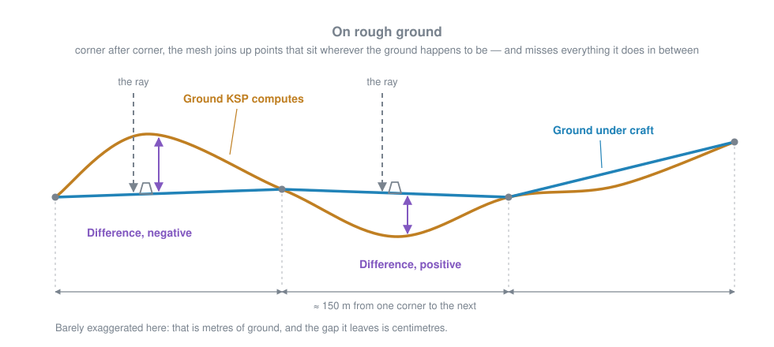
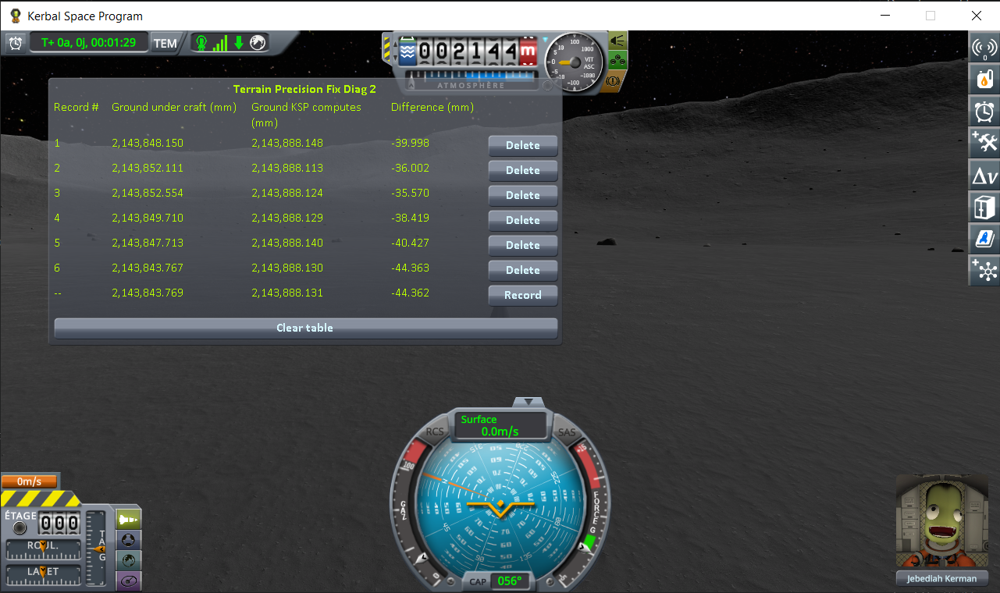
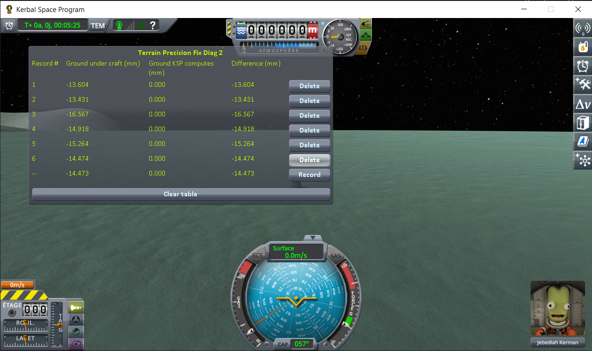
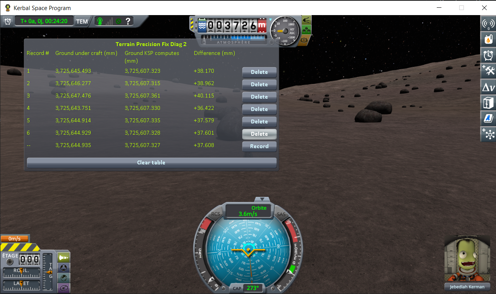
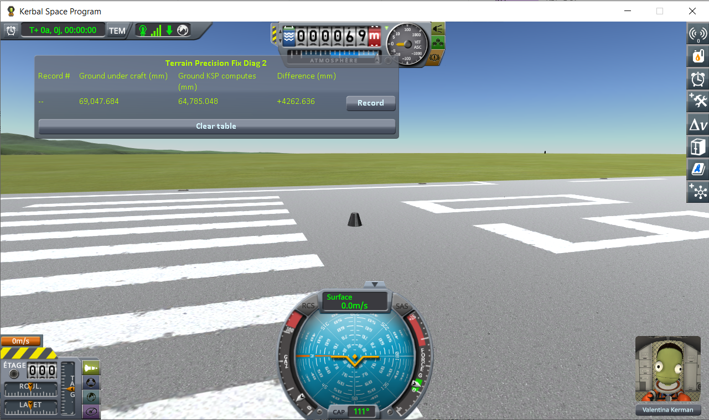
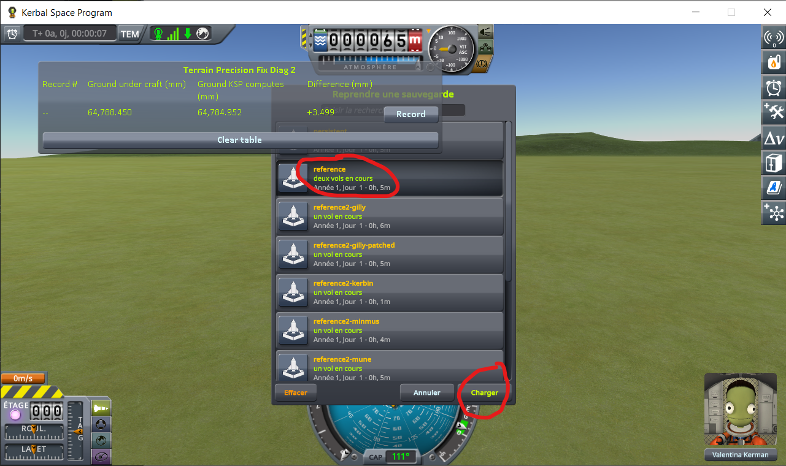

# Terrain Precision Fix - Diagnostic Mod 2

A measuring instrument for KSP 1.12. It lets you check, on your own install, a claim about the patch
of ground your craft is parked on:

> **The ground KSP builds under you is never built at the same height twice.** Load the same save five
> times, and the surface your craft is standing on comes back a little higher or a little lower each
> time — a few centimetres apart on Kerbin, less on smaller worlds.

## Why it matters

Every time you load, it is a coin toss between two outcomes.

**The ground comes back lower than it was when you saved.** Your craft is now hovering a couple of
centimetres above it, so it drops those two centimetres. You never notice, and nothing breaks.

**The ground comes back higher than it was when you saved.** Your craft is now *inside* the ground —
and the physics engine will not leave two solid things overlapping. It pushes them apart, hard, in
the only direction available: up. Your craft gets launched.

That second case is the symptom everybody already knows. The lander that twitches, hops or flips the
moment the scene finishes loading. The base that sat perfectly flush yesterday and is buried up to
the hatches today. The big base that tears itself apart the very first time you load it, and never
again afterwards. A craft with many parts spread over a wide area gives the coin toss more chances
to land the wrong way up.

### Disclaimer: it is not the only cause

The ground moving is one cause among several, and this page does not claim it is the only one. Plenty
of other things move a craft when a scene opens. Two well-known examples, among others:

- **suspensions.** Landing legs and wheels come back fully extended, because that is the only state
  KSP can restore them to. They then compress under the weight of the craft, and the craft moves
  while they do.
- **a craft bent to fit the ground.** While you play, physics twists the joints between parts so the
  craft settles onto the shape of the ground beneath it. That twisting is not saved. On loading, the
  craft comes back in its original, unbent shape — and if the ground is not flat, part of it really
  *is* underground, with no measurement error involved.

Neither of them touches the reading below: this instrument measures the ground itself, and does not
care what the craft standing on it is made of.

## This mod's demonstration

There are two grounds in KSP, and they are not the same object.

One is **computed**. The game works out the height of its terrain, for any spot on any world, from the
formulas the world is made of. That is the number behind altimeters, maps, and where the sea ends.

The other is **built**. When the scene opens, the game assembles a mesh of triangles for the terrain
around you. That mesh is what your landing legs touch, what your wheels roll on, what stops you
falling through.

They should agree. This mod reads both, for the spot your craft is standing on, and records them side
by side — one line per loading, so that reloading the same save a few times fills a table you can read
straight down.

The built one is read by pointing a ray straight down at it and asking the physics engine where it was
stopped:

```csharp
private static double MeasureCollisionSurface(Vessel vessel)
{
    CelestialBody body = vessel.mainBody;
    Vector3 position = vessel.vesselTransform.position;
    Vector3 up = FlightGlobals.getUpAxis(body, position);
    RaycastHit hit;
    if (!Physics.Raycast(position + up * Constants.RAY_START_HEIGHT, -up, out hit,
            Constants.RAY_LENGTH, Constants.LOCAL_SCENERY_MASK, QueryTriggerInteraction.Ignore))
    {
        return double.NaN;
    }

    return (((Vector3d)hit.point - body.position).magnitude - body.pqsController.radius) * 1000.0;
}
```

The computed one is simply asked for, at the same latitude and longitude:

```csharp
private static double MeasureComputedTerrain(Vessel vessel)
{
    CelestialBody body = vessel.mainBody;
    Vector3 position = vessel.vesselTransform.position;

    return body.TerrainAltitude(
        body.GetLatitude(position),
        body.GetLongitude(position),
        allowNegative: true
    ) * 1000.0;
}
```

Two things about that pair are deliberate. **They share nothing but the vessel**: each one reads the
position and the body again for itself, and neither is computed from the other — which is what makes
putting them side by side worth anything. And **they describe the same spot for free**: the ray runs
along the radius through the vessel, and latitude and longitude are what a direction from the centre of
a body *is*, so they hold all the way down that radius. Wherever the ray lands, it lands at the
vessel's own latitude and longitude — whatever the slope, and however the craft leans. Both sides are
in double precision from end to end, because reading a few millimetres out of six hundred kilometres
leaves no room for anything less.

It is the second instrument for the same problem. The first,
[Terrain Precision Fix Diag](https://github.com/lhervier/KSP-TerrainPrecisionFixDiag), measures the
**craft**: it shows that a craft set down on the ground does not come to rest where the save left it,
one loading to the next. This one measures **the ground** itself, and does not care what the craft
does.

### Why a correct reading is not zero

The two never land on the same number, and they are not supposed to. Zero is the wrong thing to hope
for: **a correct reading is a small number that is not zero**, and it is the shape of the ground that
decides how large it is and which sign it takes.

The collision mesh is made of flat triangles about a hundred and fifty metres across, with their
corners sitting on the surface the game computes. Chained one to the next, those flat pieces do follow
the lie of the land — that is what makes a mesh look like ground at all. What they cannot follow is
what the ground does *between* two corners. A hummock, a dip, the shoulder of a crater: the flat piece
cuts straight across, and the ray hits it wherever it happens to pass.



So the ray stops short of the computed height, or goes past it, by whatever the mesh left out — on
broken ground, centimetres. The sign is the ground's to give: under the computed height where the
ground rises between two corners, over it where it dips. None of that is the defect this page is
about, and — the part that matters — **none of it should move from one loading to the next**: the
shape of the terrain should be worked out the same way every time, so whatever a hillock adds to your
reading, it ought to add again on the next loading, to the micrometre. Which is what makes the reading
worth taking on a slope or in a crater just as much as on a lawn — the Mun and Gilly tables further
down were taken on ground that is anything but flat. Whatever the terrain is doing, it is not what
varies.

A legitimate zero exists, it is simply not something you can aim for: right on a corner, the one place
where the mesh touches the surface it stands in for, and anywhere between two corners where the ground
happens to cross the flat piece spanning it. Everywhere else there is a gap.

> **And note that even perfectly flat ground does not read zero.** Worlds in KSP are round, so a flat
> triangle laid across the curve of one sags below it — the way a straight plank across the top of a
> barrel touches only at its two ends. On Kerbin that sag is about **−5.5 mm**. It is the floor under
> every reading, and out on ground as flat as the apron by the runway it is very nearly the whole of a
> correct one: negative, and known before you take it. Worth holding on to for the Kerbin campaign
> further down, which was run on that apron.

**A zero is not what a healthy reading looks like. A number that repeats across loadings is.**

## The window

In flight, a window shows a table with one line per loading. The **bottom line is the reading in
progress**: it carries `--` where the others carry a record number, since it is not a record until the
*Record* button at the end of it freezes it into the table. The table survives scene changes, so the
lines pile up as you reload.


| column | meaning |
|---|---|
| **Ground under craft** | the height of the surface your craft is resting on, found by pointing a ray straight down at it |
| **Ground KSP computes** | the height the game works out for that same spot |
| **Difference** | the first minus the second |

All three are in millimetres, above sea level for the first two.

Every frozen line carries a *Delete* button, and *Clear table* throws away the lot. The table lives in
memory only, and empties itself when KSP is closed.

The bottom line is measured afresh every frame, so it follows your craft: drive a rover and you watch
both heights change as the ground under it changes. What you record has to be taken standing still —
stop, wait for the digits to stop moving, then press *Record*.

That wait is short. It is the craft settling, not the ground: the terrain is built when the scene
opens and does not move afterwards. Once the craft is still, the numbers are still.

## Six loadings of the same save

The experiment is one thing, repeated. Park a craft on bare ground, let it settle, save once — then
load that same save, press *Record*, load it again, record again, and keep going until you have five
or six lines. Nothing changes in between: not the craft, not the spot, not the world. Every line is
the same question, asked again. (Step by step, with screenshots, in
[The protocol](#the-protocol) further down.)

### The readings

On Kerbin first: one save, on the flat grass just off the end of the runway, loaded six times.


(The bottom line of the screenshot is the sixth loading, still live, not a seventh one. It carries
`--` instead of a number, since it is not a record until you freeze it.)

Then the same campaign on the Mun, on Minmus and on Gilly — the first and the last of those on ground
that is anything but flat:







### What the numbers say

**Ground KSP computes never moves.** On Kerbin it reads 64,784.952 on all six lines of the screenshot,
the same eight digits every time; on the Minmus flats, `0.000` six times over, which is as plain as
this argument gets. The most it ever wanders is on the Mun and on Gilly, by four or five hundredths of
a millimetre — and those are also the two spots where the ground is not level: a craft that settles a
hair to one side is asking for the height of a slightly different point, and on a slope that shows.
Nothing surprising in any of it. That height is worked out from the formulas the world is made of, and
reloading a save does not change the world.

**Ground under craft moves every time.** On Kerbin it lands somewhere else on each of the six lines,
over a range of ten centimetres. And since *Difference* is one column minus the other, it carries the
whole of that movement — which is what lets the four campaigns be put side by side on that one column
alone, in millimetres:

| loading | Kerbin | Mun | Minmus | Gilly |
|---|---|---|---|---|
| 1 | +48.139 | −39.998 | −13.604 | +38.170 |
| 2 | +78.164 | −36.002 | −13.431 | +38.962 |
| 3 | −2.031 | −35.570 | −16.567 | +40.115 |
| 4 | +77.765 | −38.419 | −14.918 | +36.422 |
| 5 | −28.477 | −40.427 | −15.264 | +37.579 |
| 6 | +31.155 | −44.363 | −14.474 | +37.601 |
| **lowest to highest** | **106.6** | **8.8** | **3.1** | **3.7** |
| *the same, for* **Ground KSP computes** | *0.000* | *0.035* | *0.000* | *0.046* |

The bottom two rows are the argument entire. The craft never moved and the spot never changed, so
nothing about that patch of ground was different from one loading to the next — and yet one of the two
heights held still while the other wandered by tens of millimetres. The one that moved is the one that
is wrong, and it is the one that describes the surface your landing legs actually touch: it was simply
not built in the same place twice.

The sign says it too. That grass is about as flat as Kerbin gets, so a correct reading there is
negative, and around −5.5 mm at that. Four of the six lines are positive: they are not merely
scattered, they are on the wrong side of the only value they could legitimately have had.

Smaller world, smaller spread — but it never goes away, and on none of the four does it come close to
what the computed height does: two to three orders of magnitude, world after world, between one row
and the one under it.

All four campaigns were run on the same **stock install**, with nothing added to `GameData` but this
mod. There is no mod conflict to look for, and nothing to uninstall: this is what KSP does on its own.

Every figure above is read straight off the screenshots above it, and nothing here asks you to take
any of them on trust: reproducing them is what this mod is for.

## The protocol

**1. Launch a craft.** Anything will do — the ray does not care what it is made of.



(The probe window is draggable — drop it wherever it does not get in the way.)

Note what it reads there: **+4,262.636 mm**. The ray is hitting the runway, and the runway deck sits
four metres above the terrain the game computes underneath it. Which is what the next step is about.

**2. Move it off onto bare ground.** `Alt+F12 → Cheats → Set Position`. Tick *Use middle click to set
position*, set *Pitch* to 90 so the craft comes down upright, then middle-click a patch of grass just
off the end of the runway. No need to go far, but you do have to be off the tarmac itself.


**3. Save once.**


**4. Load that same save.** Not a new save — the one from step 3.



**5. Wait for the digits to stop moving, then press *Record*.** They stop when the craft does — on a
slope it may still be creeping downhill, and the readings creep with it.


The first line appears, with the live line carrying on underneath it.


**6. Load the same save again.** The one from step 3, again.


**7. Settle, and record again.** A second line appears under the first — and *Difference* has already
moved, by thirty millimetres.


**8. Repeat steps 6 and 7** until you have five or six lines. One loading proves nothing: the error is
drawn afresh every time, and can come out small by luck.


Then install [Terrain Precision Fix](https://github.com/lhervier/KSP-TerrainPrecisionFix) and do the
same thing again.

## Get it

Either way you end up with the same `GameData/TerrainPrecisionFixDiag2Mod/` folder.

**Download it** — from the assets of the
[latest release](https://github.com/lhervier/KSP-TerrainPrecisionFixDiag2/releases/latest).

**Or compile it** — clone this repository, set `KSPDIR` to your KSP install folder and run
`build.bat`. It needs the .NET SDK, takes a few seconds, reads the KSP assemblies straight from your
install, and puts the DLL in `GameData/TerrainPrecisionFixDiag2Mod/` inside the repository. It does
not install anything. Worth doing if you would rather not run a binary you have no source for while
reporting a measurement.

## Install

Drop `GameData/TerrainPrecisionFixDiag2Mod` into the `GameData` of KSP, so that you end up with
`GameData/TerrainPrecisionFixDiag2Mod/TerrainPrecisionFixDiag2Mod.dll`. It runs on a stock install:
no Harmony, no ModuleManager, no dependency of any kind.

It reads the world and writes nothing at all: the table lives in memory and is gone when you close the
game. Your saves are never touched. Removing the folder removes the mod.

## License

MIT
