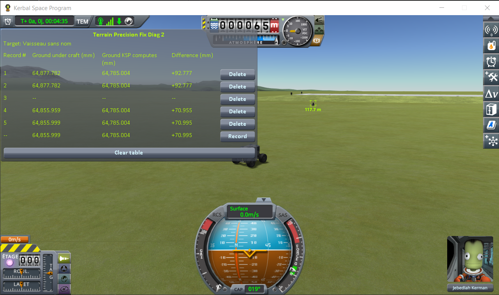

# The measurements: coming back to a craft you left

Part of [Terrain Precision Fix Diag 2](../README.md): the readings taken with
[the approach protocol](the-protocol-approach.md) — a craft parked on flat ground, a rover driving
away until the game unloads it, then coming back. Nothing is loaded at any point: from the first line
to the last, it is one single flight. The other series are in
[The measurements: loading the same save](the-measurements-loading.md) and
[The measurements: switching to a craft far away](the-measurements-switching.md).

The save the protocol uses is [`diag/approach-kerbin.sfs`](../diag/approach-kerbin.sfs), and
[the protocol page](the-protocol-approach.md#the-save) says what it holds. The six round trips below
were taken with an earlier version of it: the same two craft, a few metres apart, 1.4 km further
east.

## The install

KSP 1.12.5 on Windows, with `GameData` holding Harmony, ModuleManager,
[KSP Community Fixes](https://github.com/KSPModdingLibs/KSPCommunityFixes) 1.41.1 and this mod, and
nothing else.

## The readings

Six round trips in a row, in one flight. The table was cleared between them, so each screenshot holds
one round trip and its first line is the last line of the one before. The bottom line of each is the
reading in progress, not a record. The round trip pictured under the protocol is the third.

**Ground KSP computes** reads 64,785.004 mm on every line of the six screenshots, so every change
below is a change of the ground under the craft. In *Difference*, in millimetres:

| round trip | line 2, before | line 4, back in range | line 5, settled | across the round trip | screenshot |
|---|---|---|---|---|---|
| 1 | +92.777 | +70.955 | +70.995 | **−21.782** | [`run1.png`](../imgs/measures/approach/run1.png) |
| 2 | +70.995 | +76.871 | +76.899 | **+5.904** | [`run2.png`](../imgs/measures/approach/run2.png) |
| 3 | +76.899 | +81.476 | +81.462 | **+4.563** | [`run3.png`](../imgs/measures/approach/run3.png) |
| 4 | +81.462 | +86.167 | +86.151 | **+4.689** | [`run4.png`](../imgs/measures/approach/run4.png) |
| 5 | +86.151 | +80.062 | +80.055 | **−6.096** | [`run5.png`](../imgs/measures/approach/run5.png) |
| 6 | +80.055 | +82.722 | +82.731 | **+2.676** | [`run6.png`](../imgs/measures/approach/run6.png) |

Line 1 of every round trip is not in the table: it carries, to the micrometre, the same three numbers
as line 2.

## What these readings show

**The height KSP computes never moves.** The same digits on every line, from the first round trip to
the last.

**The ground under the craft comes back somewhere else every time.** From 2.7 to 21.8 mm per round
trip, upwards or downwards. Over the whole series — where it started, and where each of the six
round trips left it — it spans 21.8 mm.

**It moves while the craft is away.** Driving off does not move it: lines 1 and 2 are the same to the
micrometre. By the time the craft is back in range, line 4, before physics has taken it over, the
ground is already somewhere else. From line 4 to line 5, when physics takes the craft over, it moves
by 0.040 mm at most — the craft settling and moving the spot the ray is fired at.

**Nothing was loaded.** No scene change, no save, no quickload: the whole series was taken in one
flight, by driving away and coming back.

The size is not the same from one round trip to the next. That is why the protocol asks for a series.
