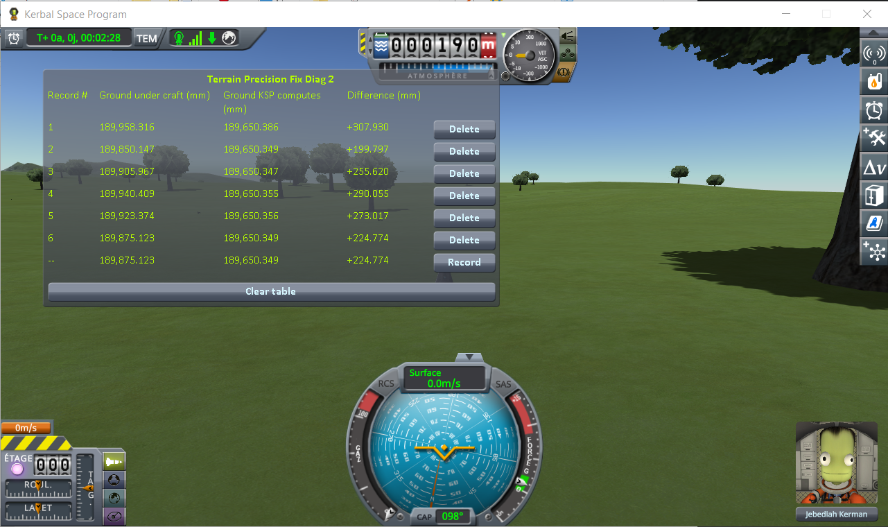
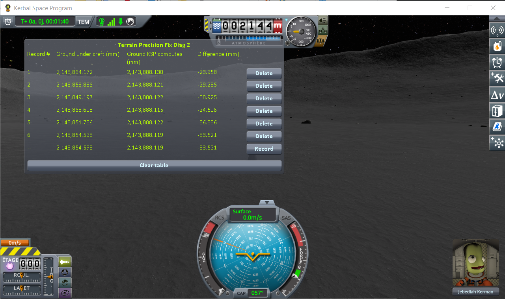
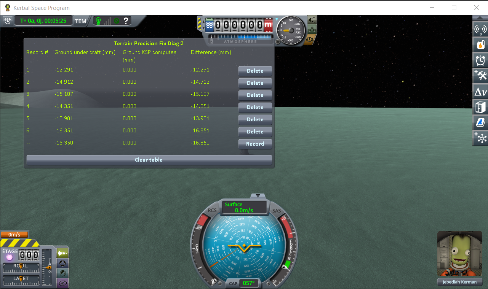
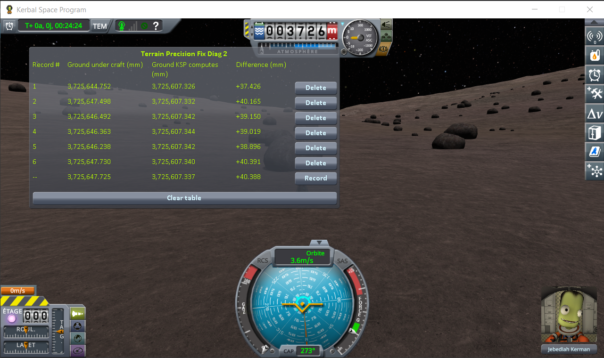

# The measurements: loading the same save

Part of [Terrain Precision Fix Diag 2](../README.md): the readings taken with this instrument, on four worlds. The steps that produced them are in [The protocol: loading the same save](the-protocol-loading.md). The other series are in [The measurements: coming back to a craft you left](the-measurements-approach.md) and [The measurements: switching to a craft far away](the-measurements-switching.md).

The experiment is one thing, repeated. Park a craft on bare ground, let it settle, save once — then
load that same save, press *Record*, load it again, record again, and keep going until you have five
or six lines. Nothing changes in between: not the craft, not the spot, not the world. Every line is
the same question, asked again. (Step by step, with screenshots, in
[The protocol: loading the same save](the-protocol-loading.md).)

## The install

KSP 1.12.5 on Windows, with `GameData` holding Harmony, ModuleManager,
[KSP Community Fixes](https://github.com/KSPModdingLibs/KSPCommunityFixes) 1.41.1 and this mod, and
nothing else — what most players run, give or take their other mods.

## The readings

On Kerbin first: one save, on a grassy slope some eight kilometres west of the KSC, loaded six times.

(The bottom line of the screenshot is the sixth loading, still live, not a seventh one. It carries
`--` instead of a number, since it is not a record until you freeze it.)

Then the same campaign on the Mun, on Minmus and on Gilly:

## What the numbers say

**Ground KSP computes never moves.** On the Minmus flats it reads `0.000` six times over, which is as
plain as this argument gets. Everywhere else it wanders by a few hundredths of a millimetre at most —
on ground that is not level, a craft that settles a hair to one side is asking for the height of a
slightly different point, and on a slope that shows. Nothing surprising in any of it. That height is
worked out from the formulas the world is made of, and reloading a save does not change the world.

**Ground under craft moves every time.** On Kerbin it lands somewhere else on each of the six lines,
over a range of ten centimetres. And since *Difference* is one column minus the other, it carries the
whole of that movement — which is what lets the four campaigns be put side by side on that one column
alone, in millimetres:

| loading | Kerbin | Mun | Minmus | Gilly |
|---|---|---|---|---|
| 1 | +307.930 | −23.958 | −12.291 | +37.426 |
| 2 | +199.797 | −29.285 | −14.912 | +40.165 |
| 3 | +255.620 | −38.925 | −15.107 | +39.150 |
| 4 | +290.055 | −24.506 | −14.351 | +39.019 |
| 5 | +273.017 | −36.386 | −13.981 | +38.896 |
| 6 | +224.774 | −33.521 | −16.351 | +40.391 |
| **lowest to highest** | **108.1** | **15.0** | **4.1** | **3.0** |
| *the same, for* **Ground KSP computes** | *0.039* | *0.015* | *0.000* | *0.018* |

The bottom two rows are the argument entire. The craft never moved and the spot never changed, so
nothing about that patch of ground was different from one loading to the next — and yet one of the two
heights held still while the other wandered by tens of millimetres. The one that moved is the one that
is wrong, and it is the one that describes the surface your landing legs actually touch: it was simply
not built in the same place twice.

On Kerbin, *Difference* sits two to three hundred millimetres away from zero on every line. That
offset belongs to the spot, not to the loading: on uneven ground, the flat triangles the game collides
with miss the shape of the terrain by far more than on flat ground (see
[Why a correct reading is not zero](this-mods-demonstration.md#why-a-correct-reading-is-not-zero)).
That part is the same on every loading, so it does not reach the spread — only the part that moves
does.

Smaller world, smaller spread — but it never goes away, and on none of the four does it come close to
what the computed height does: two to three orders of magnitude, world after world, between one row
and the one under it.

Every figure above is read straight off the screenshots above it, and nothing here asks you to take
any of them on trust: reproducing them is what this mod is for.
