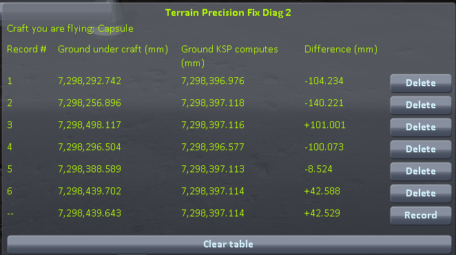
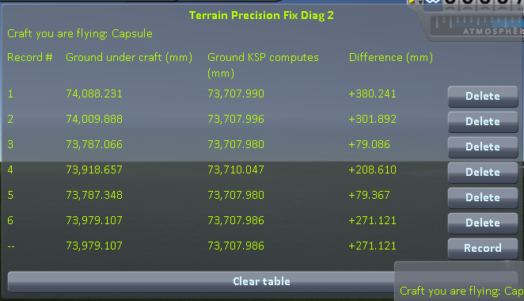

# The measurements: loading the same save

Part of [Terrain Precision Fix Diag 2](../README.md): the readings taken with this instrument, on four worlds, then on two much larger ones. The steps that produced them are in [The protocol: loading the same save](the-protocol-loading.md). The other series are in [The measurements: coming back to a craft you left](the-measurements-approach.md) and [The measurements: switching to a craft far away](the-measurements-switching.md).

The experiment is one thing, repeated. Park a craft on bare ground, let it settle, save once — then
load that same save, press *Record*, load it again, record again, and keep going until you have five
or six lines. Nothing changes in between: not the craft, not the spot, not the world. Every line is
the same question, asked again. (Step by step, with screenshots, in
[The protocol: loading the same save](the-protocol-loading.md).)

## The install

KSP 1.12.5 on Windows, with `GameData` holding Harmony, ModuleManager,
[KSP Community Fixes](https://github.com/KSPModdingLibs/KSPCommunityFixes) 1.41.1 and this mod, and
nothing else — what most players run, give or take their other mods.

## The readings

On Kerbin first: one save, on a grassy slope some eight kilometres west of the KSC, loaded six times.

(The bottom line of the screenshot is the sixth loading, still live, not a seventh one. It carries
`--` instead of a number, since it is not a record until you freeze it.)

Then the same campaign on the Mun, on Minmus and on Gilly:

*Difference* is one column minus the other, so it carries the whole of the movement of either; the
four campaigns side by side on that column, in millimetres:

| loading | Kerbin | Mun | Minmus | Gilly |
|---|---|---|---|---|
| 1 | +307.930 | −23.958 | −12.291 | +37.426 |
| 2 | +199.797 | −29.285 | −14.912 | +40.165 |
| 3 | +255.620 | −38.925 | −15.107 | +39.150 |
| 4 | +290.055 | −24.506 | −14.351 | +39.019 |
| 5 | +273.017 | −36.386 | −13.981 | +38.896 |
| 6 | +224.774 | −33.521 | −16.351 | +40.391 |
| **lowest to highest** | **108.1** | **15.0** | **4.1** | **3.0** |
| *the same, for* **Ground KSP computes** | *0.039* | *0.015* | *0.000* | *0.018* |

## On Real Solar System

The same campaign on two bodies of [Real Solar System](https://github.com/KSP-RO/RealSolarSystem), a
mod that replaces the planets with the real ones: the Moon, more than three times the radius of Kerbin,
and Earth, more than ten times.

**The install.** The one above, plus Real Solar System 20.1.3.0 and what it requires (Kopernicus,
Modular Flight Integrator, KSPTextureLoader, the RSS textures), on an install of its own, with
[Terrain Precision Fix Diag 1](https://github.com/lhervier/KSP-TerrainPrecisionFixDiag) open as well.
The saves are in [`diag`](../diag/README.md#on-real-solar-system); they only load there. The craft is a
capsule on an empty fuel tank: six loadings of `reload-moon-rss-resave.sfs` on flat ground on the Moon,
and six of `reload-earth-rss-resave.sfs` on the grass about 1.4 km west of the KSC on Earth.

*Difference*, in millimetres:

| loading | the Moon | Earth |
|---|---|---|
| 1 | −104.234 | +380.241 |
| 2 | −140.221 | +301.892 |
| 3 | +101.001 | +79.086 |
| 4 | −100.073 | +208.610 |
| 5 | −8.524 | +79.367 |
| 6 | +42.588 | +271.121 |
| **lowest to highest** | **241.2** | **301.2** |
| *the same, for* **Ground KSP computes** | *0.541* | *2.067* |

The sessions are logged in [`diag/runs`](../diag/README.md#on-real-solar-system).

## What the numbers say

**Ground KSP computes never moves.** On the Minmus flats it reads `0.000` six times over, which is as
plain as this argument gets. Everywhere else it wanders by a few hundredths of a millimetre at most —
on ground that is not level, a craft that settles a hair to one side is asking for the height of a
slightly different point, and on a slope that shows. Nothing surprising in any of it. That height is
worked out from the formulas the world is made of, and reloading a save does not change the world. On
Real Solar System it moved a little more, for the same reason: on the Moon at the first and fourth
loadings, where the craft came to rest a little to one side; on Earth, the 2 mm all come from the
fourth loading, where the craft jumped and landed elsewhere.

**Ground under craft moves every time.** On Kerbin it lands somewhere else on each of the six lines,
over a range of ten centimetres, and on none of the six bodies does it come back to the same place:
3.0 mm on Gilly, 4.1 mm on Minmus, 15.0 mm on the Mun, 108.1 mm on Kerbin, then 241.2 mm on the Moon
of Real Solar System and 301.2 mm on its Earth. Smaller world, smaller spread — but it never goes away.

The bottom two rows of each table are the argument entire. The craft's save never changed and the spot
never changed, so nothing about that patch of ground was different from one loading to the next — and
yet one of the two heights held still while the other wandered, by two to three orders of magnitude
more, world after world. The one that moved is the one that is wrong, and it is the one that describes
the surface your landing legs actually touch: it was simply not built in the same place twice.

On Kerbin, *Difference* sits two to three hundred millimetres away from zero on every line. That
offset belongs to the spot, not to the loading: on uneven ground, the flat triangles the game collides
with miss the shape of the terrain by far more than on flat ground (see
[Why a correct reading is not zero](this-mods-demonstration.md#why-a-correct-reading-is-not-zero)).
That part is the same on every loading, so it does not reach the spread — only the part that moves
does.

Every figure above is read straight off the screenshots above it, and nothing here asks you to take
any of them on trust: reproducing them is what this mod is for.
