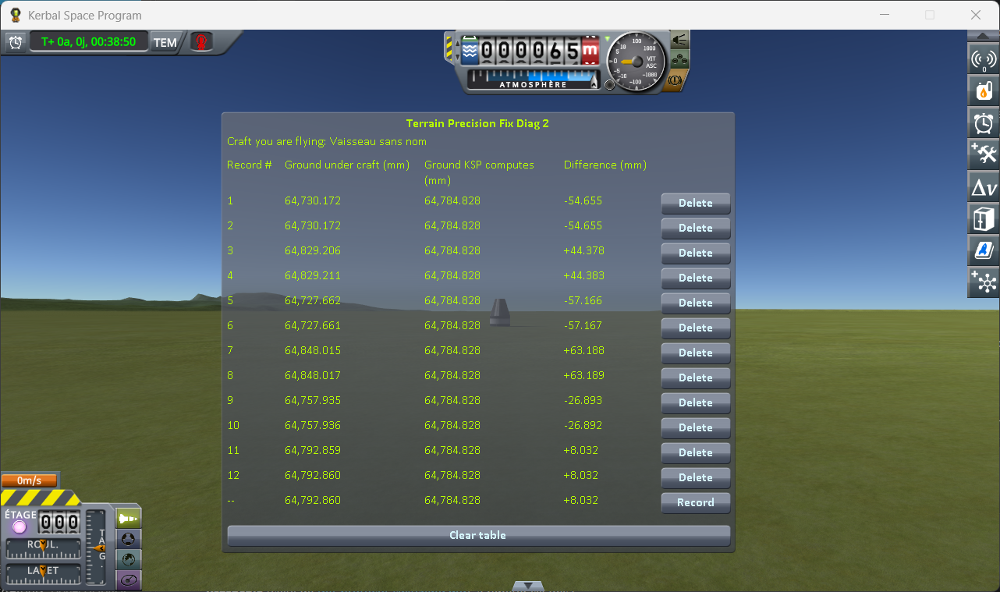

# The measurements: switching to a craft far away

Part of [Terrain Precision Fix Diag 2](../README.md): the readings taken with
[the switching protocol](the-protocol-switching.md) — a capsule and a rover landed 1.97 km apart, the
save loaded while flying the rover, then the game's *switch vessel* key pressed to fly the capsule.
The other series are in [The measurements: loading the same save](the-measurements-loading.md) and
[The measurements: coming back to a craft you left](the-measurements-approach.md).

The save the protocol uses is [`diag/switch-kerbin.sfs`](../diag/switch-kerbin.sfs), and
[the protocol page](the-protocol-switching.md#the-save) says what it holds.

## The install

KSP 1.12.5 on Windows, with `GameData` holding Harmony, ModuleManager,
[KSP Community Fixes](https://github.com/KSPModdingLibs/KSPCommunityFixes) 1.41.1 and this mod, and
nothing else.

## The readings

Six rounds, two lines each: the first recorded as the save opens, flying the rover, the second a few
seconds after switching to the capsule. The bottom line of the screenshot is the reading in progress,
not a record.

**Ground KSP computes** reads 64,784.828 mm on all twelve lines. In *Difference*, in millimetres:

| round | as the save opens | after the switch | moved by the switch |
|---|---|---|---|
| 1 | −54.655 | −54.655 | 0.000 |
| 2 | +44.378 | +44.383 | +0.005 |
| 3 | −57.166 | −57.167 | −0.001 |
| 4 | +63.188 | +63.189 | +0.001 |
| 5 | −26.893 | −26.892 | +0.001 |
| 6 | +8.032 | +8.032 | 0.000 |
| **lowest to highest** | **120.4 mm** | **120.4 mm** | |

## What these readings show

**The height KSP computes never moves.** The same digits on all twelve lines.

**The ground under the capsule is somewhere else at every loading.** From one round to the next it
lands anywhere within 120.4 mm, upwards as well as downwards — of the same order as
[the loading series](the-measurements-loading.md) on Kerbin, and for the same reason: every round
starts by loading the save.

**The switch does not move it.** Within a round, the line taken after the switch reads the ground the
line before it read, to within five thousandths of a millimetre — the capsule settling a hair once
physics takes it over, and moving the spot the ray is fired at with it. Whatever the ground under the
capsule is going to be, it already is the moment the save opens — with the capsule still two
kilometres from the craft being flown, and not yet flown itself.

## The logs

[`diag/runs/switching-stock.log`](../diag/runs/switching-stock.log) — the `KSP.log` of the session
the six rounds were taken in.
