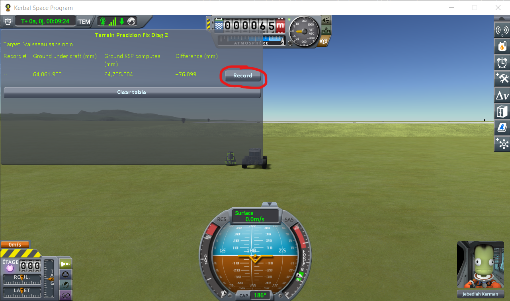
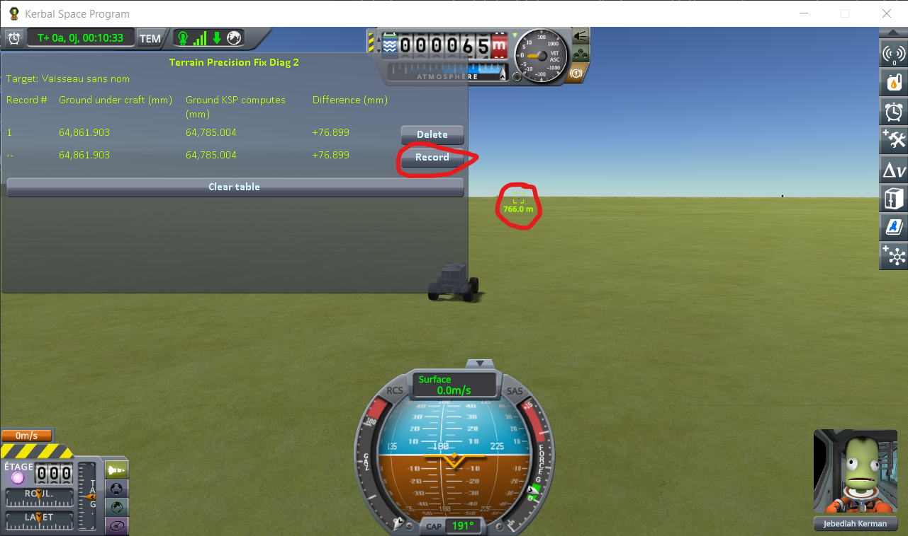
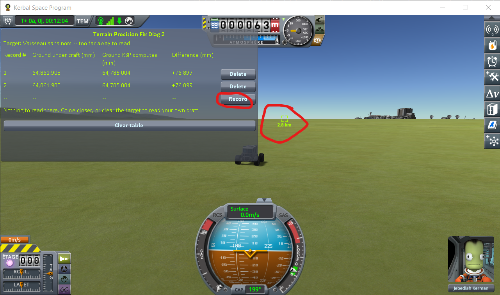
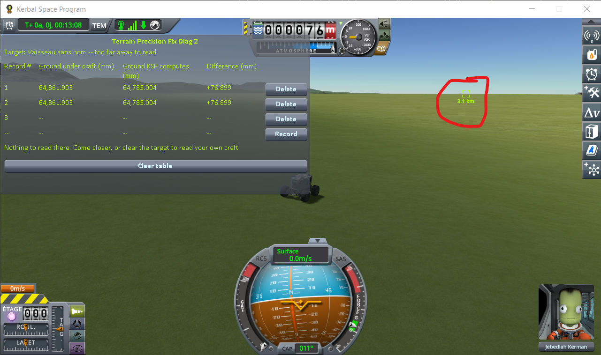
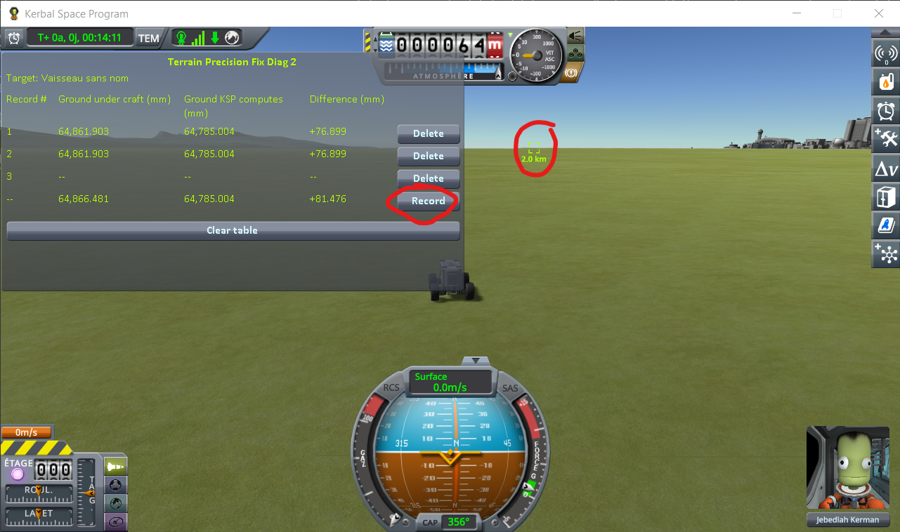
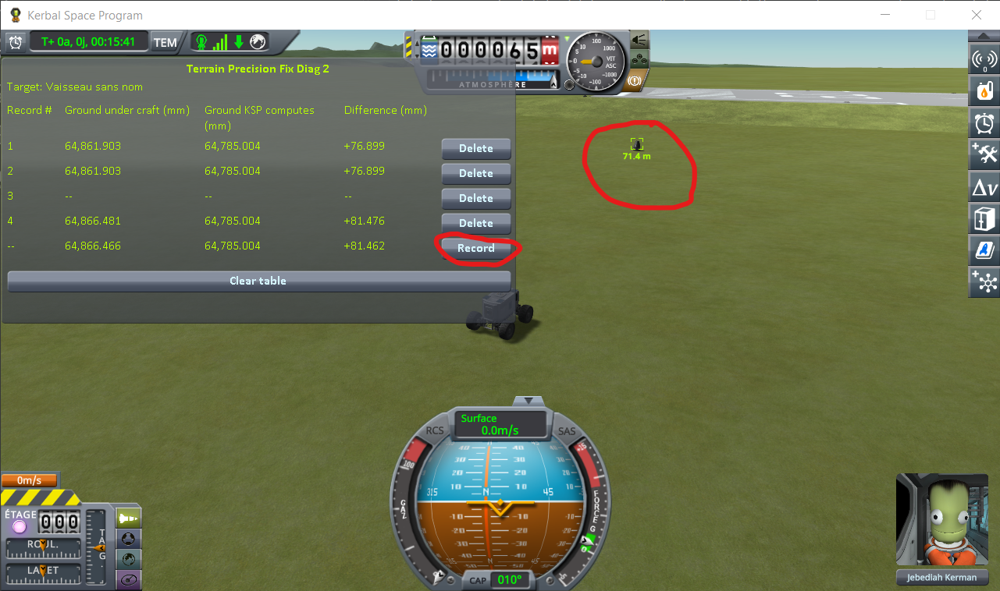

# The protocol: coming back to a craft you left

Part of [Terrain Precision Fix Diag 2](../README.md): how to read the ground under a craft that is
loaded into a scene already running, step by step. Nothing is loaded here — from the first line to
the last, it is one single flight. The columns it fills are in [The window](the-window.md), and what
it reads is in [The measurements: coming back to a craft you left](the-measurements-approach.md).

The two other protocols read the ground under a craft handed back by a save —
[The protocol: loading the same save](the-protocol-loading.md) — and under a craft you switch to —
[The protocol: switching to a craft far away](the-protocol-switching.md).

A craft is parked on flat ground. A rover drives far enough for the game to unload it, then comes
back, and the window reads the ground under the parked craft throughout.

## The save

[`approach-kerbin.sfs`](../diag/approach-kerbin.sfs), a sandbox game of KSP 1.12.5. Copy it into the
folder of a sandbox game and load it from that game. It holds two craft, 26 m apart on the flat grass
west of the KSC:

- **the craft whose ground is read**: a Mk1 command pod on an FL-T100 tank, landed at latitude
  −0.0610°, longitude −74.7395°. It is already the target of the other one, so the window reads the
  ground under it from the moment the scene opens, and you have nothing to set;
- **the rover you drive**: a crewed rover on four wheels, with batteries and solar panels to recharge
  them.

You can of course build your own two craft instead. The parked one only has to stay where it is.

## The distances that decide everything

They are the game's own, from the `VesselRanges` of `Physics.cfg`. A landed craft is **unloaded at
2500 m**, **loaded again at 2250 m**, **packed at 350 m**, and **handed over to physics at 200 m**.

Unloaded and loaded again are not the same distance on purpose, so that a craft sitting right at the
limit does not load and unload over and over. Coming back, the numbers reappear at 2250 m — not at
2500 m, where they went away.

## The protocol

Load the save and **do not change scene again** — no save, no load, no trip back to the space centre.
Everything below happens in one flight, and that is the whole point of these readings.

Then, per round trip, five records.

**1. Next to it.** Press *Record* without moving.

**2. A few hundred metres away.** Drive off, past 350 m, and press *Record*.

**3. Out of range.** Keep going past 2500 m, until the line reads `too far away to read`, and press
*Record* on the empty line.

**4. Turn round.** Stop beyond 3 km, turn, and drive back. Nothing to record here.

**5. Back in range.** Once the numbers come back, press *Record*.

**6. Back beside it.** Come within 200 m, give it three to five seconds to settle, and press *Record*.

## What the five lines are worth

| line | where | what the game is doing to the parked craft | what the line is worth |
|---|---|---|---|
| 1 | beside it | loaded, physics running on it | the ground as the round trip starts |
| 2 | ~700 m | packed again, still loaded | the same ground, read once the rover has driven off |
| 3 | past 2500 m | unloaded | nothing to read — it is the proof the round trip really happened |
| 4 | back under 2250 m | loaded again, still packed | the ground the craft comes back to |
| 5 | under 200 m | handed over to physics | the ground it settles on |

All five are readings. The ray reads the ground under the craft whatever the game is doing to the
craft itself, so a packed craft — held where it is, with no physics running on it — reads as well as
a loaded one.

Line 3 cannot be recorded from anywhere else: the window only has nothing to show while the craft is
out of range. An empty line in the middle of the table is what tells a reader that the two records
around it really are separated by a trip out of range, and not by two readings taken on the spot.

⚠️ **Wait before recording line 5.** The craft is still settling for a second or two after physics
takes it over, and the spot the ray is fired at moves with it, by a few hundredths of a millimetre.
Waiting the same three to five seconds every time costs nothing and keeps the lines comparable.

⚠️ **Do not save while the round trips are running.** The readings are only comparable if they are
all taken in the one flight the save opened.

**Then do it again.** One round trip says nothing: the size of the reading is not the same twice. It
is the series that is worth reading, not a line.
