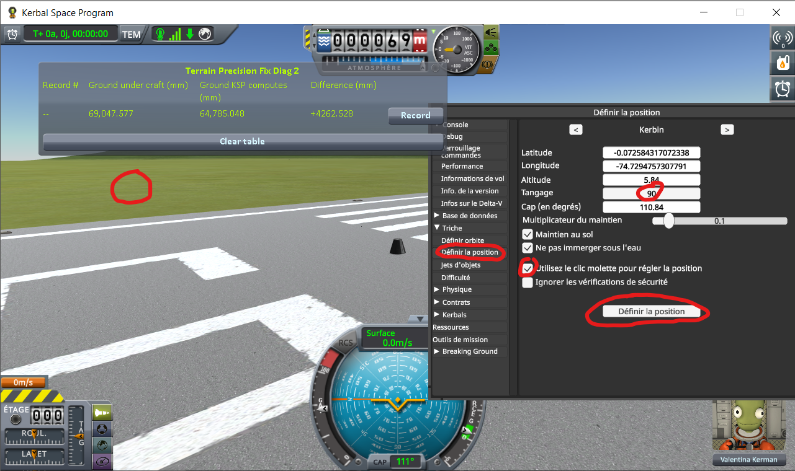
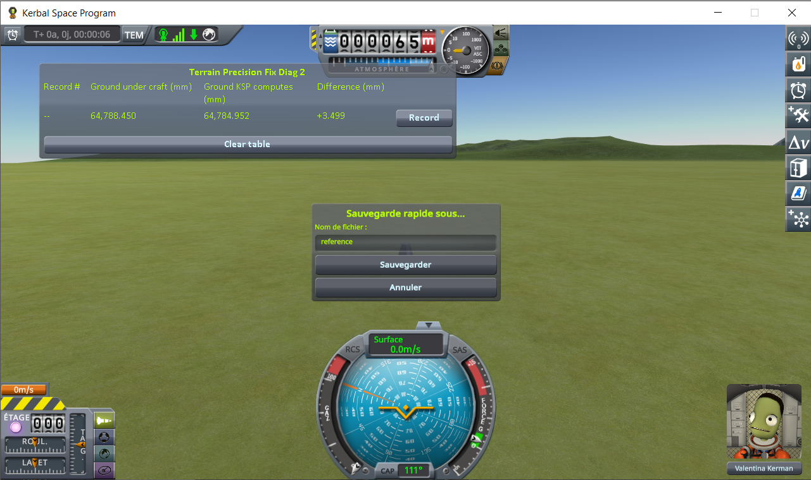
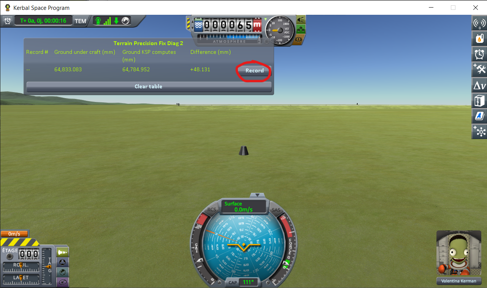
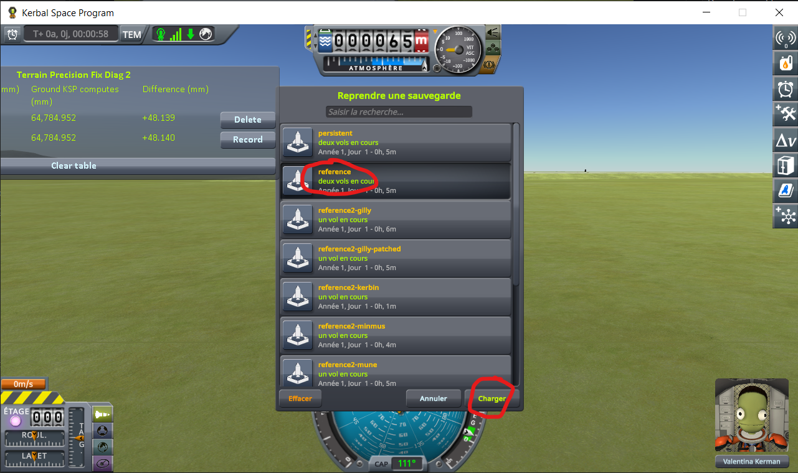
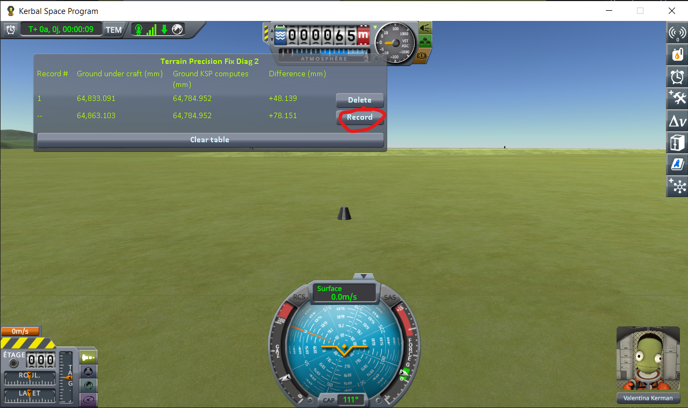
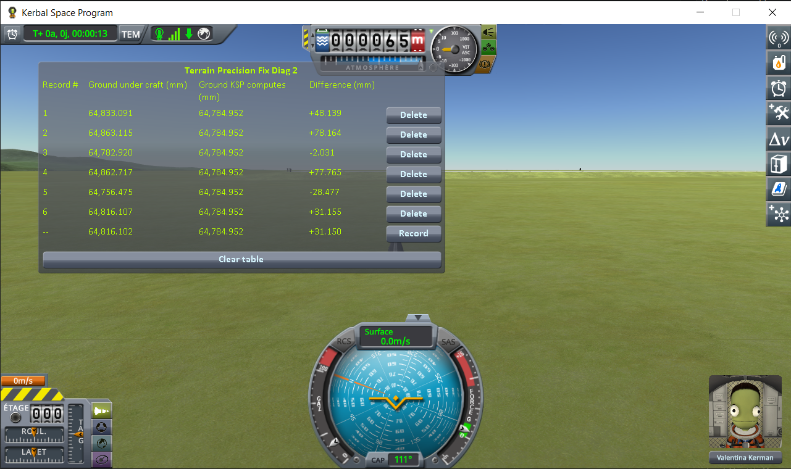

# The protocol: loading the same save

Part of [Terrain Precision Fix Diag 2](../README.md): how to take the reading yourself, step by step. The columns it fills are in [The window](the-window.md), and the readings it produced are in [The measurements: loading the same save](the-measurements-loading.md).

The two other protocols read the ground under a craft you drive away from and back to —
[The protocol: coming back to a craft you left](the-protocol-approach.md) — and under a craft you
switch to — [The protocol: switching to a craft far away](the-protocol-switching.md).

**1. Launch a craft.** Anything will do — the ray does not care what it is made of.

(The probe window is draggable — drop it wherever it does not get in the way.)

Note what it reads there: **+4,262.636 mm**. The ray is hitting the runway, and the runway deck sits
four metres above the terrain the game computes underneath it. Which is what the next step is about.

**2. Move it off onto bare ground.** `Alt+F12 → Cheats → Set Position`. Tick *Use middle click to set
position*, set *Pitch* to 90 so the craft comes down upright, then middle-click a patch of grass just
off the end of the runway. No need to go far, but you do have to be off the tarmac itself.

**3. Save once.**

**4. Load that same save.** Not a new save — the one from step 3.

**5. Wait for the digits to stop moving, then press *Record*.** They stop when the craft does — on a
slope it may still be creeping downhill, and the readings creep with it.

The first line appears, with the live line carrying on underneath it.

**6. Load the same save again.** The one from step 3, again.

**7. Settle, and record again.** A second line appears under the first — and *Difference* has already
moved, by thirty millimetres.

**8. Repeat steps 6 and 7** until you have five or six lines. One loading proves nothing: the error is
drawn afresh every time, and can come out small by luck.

Then install [Terrain Precision Fix](https://github.com/lhervier/KSP-TerrainPrecisionFix) and do the
same thing again.
