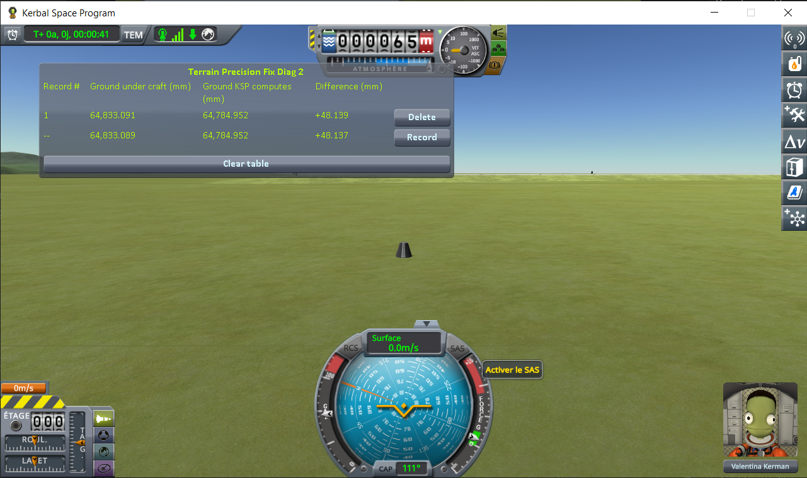

# The window

Part of [Terrain Precision Fix Diag 2](../README.md): the table the mod shows in flight, column by column. What the two heights are, and why they differ, is in [This mod's demonstration](this-mods-demonstration.md).

In flight, a window shows a table with one line per loading. The **bottom line is the reading in
progress**: it carries `--` where the others carry a record number, since it is not a record until the
*Record* button at the end of it freezes it into the table. The table survives scene changes, so the
lines pile up as you reload.

| column | meaning |
|---|---|
| **Ground under craft** | the height of the surface your craft is resting on, found by pointing a ray straight down at it |
| **Ground KSP computes** | the height the game works out for that same spot |
| **Difference** | the first minus the second |

All three are in millimetres, above sea level for the first two.

Every frozen line carries a *Delete* button, and *Clear table* throws away the lot. The table lives in
memory only, and empties itself when KSP is closed.

The bottom line is measured afresh every frame, so it follows your craft: drive a rover and you watch
both heights change as the ground under it changes. What you record has to be taken standing still —
stop, wait for the digits to stop moving, then press *Record*.

That wait is short. It is the craft settling, not the ground: the terrain is built when the scene
opens and does not move afterwards. Once the craft is still, the numbers are still.
